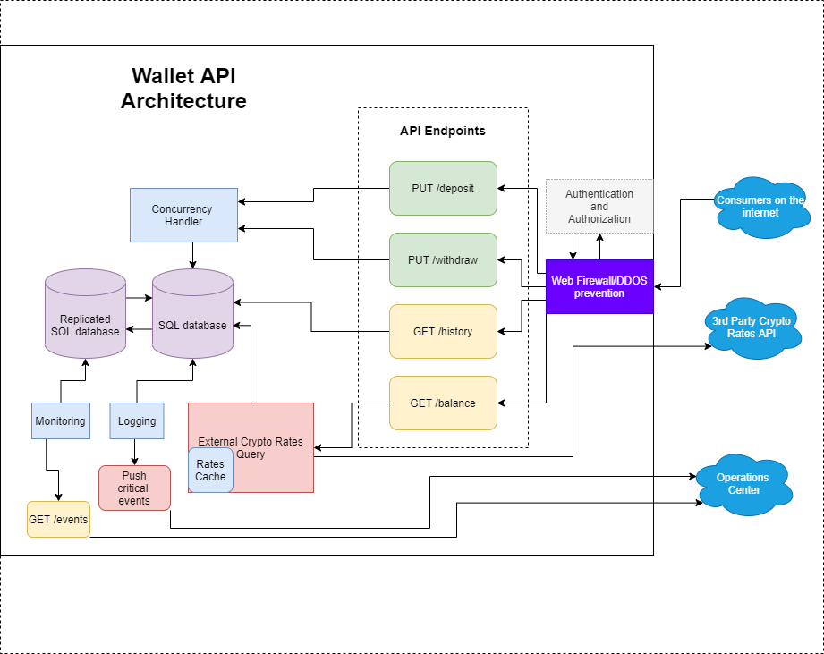

# WalletDA - Golang Project for developer skills evaluation
## About  
This project is a code challenge, described on the "specifications.pdf" file at the root of this repository. DA stands for "Diogo Andrade", my name.  
I start by describing how de guidelines on how it would work on a hypotetical production scenario. Many of thenm wouldn't be actually implemented on this excercise.  
Then I proceed on a step-by-step description on teh actual implementation, and then Finally, I present the sources I "drew inspiration from".

### Author's Background
Since I had no familiarity with GoLang prior to this project, most descriptions on this topic will begin at an abstract level, and I'll be modifying the sections to GoLang "jargon" as I improve my familiarity with it.  

# Project Considerations  
## Specifications
It is assumed that reader is already familiar with the Project's specifications.  

## Versioning
The API will use the common "/api/v`<number`>/`<endpoint>`" versioning scheme.  
So, the "withdraw" endpoint will be `"/api/v1/withdraw"`

## Running the app locally
- Must have GoLang Installed, version 1.3+
- Must have a SQL server instance avaliabe, with it's connection string already known
- Open the folder where the "main.go" file is located on a terminal
- TODO: If this is the first time run the script "createDAtabase.SQL" on SQL Management Studio tool
- TODO: If this is the first time running the project, and you want an already populated Database with test data, run the script "FillSQLDataBase.sql" on SQL management Studio
- $go run .
- The webserver should be up and running on localhost, port 8082
- Test using the application Swagger page, or another tool of choice (postman, insominia, etc.)
- TODO: set up the external 3rd party crypto Rates mock app  

## Deploying the app 
- Should use a CI/CD tool such as github actions, Azure DevOps Pipelines or BitBucket Pipelines, etc.
- There should be 3 environment of CI/CD: one for development, one for staging and the last one for production, each one targeting one Source Control branch
- All three tracked branches would be protected by a pull-request policy:
  - It must build successfully
  - It must be approved by 2 other team members
- Each environment should have its own database
- Database Secrets on Staging and Production environments should be hidden from the developers, and transformed on the CD pipeline.
- The CI pipeline should run automated unit tests
- The CD pipeline should run automated behavior tests (Postman test Suites, for example)
- The CI pipeline should build and push a docker image for the app, and the CD pipeline should deploy it.  
- The Plataform that will run the docker image is out of this project's scope

## Authorization Authentication, and application secrets
For simplicity, I did not include any authorization/authentication scheme for the Microservice endpoints, and I am assuming that the 3rd Party Exchange Rates API doesn't require any authentication scheme as well.  
But on a production environment, a strong authentication/authorization scheme should be used.
> I would use JWT authentication, since it promotes performance by including authorization claims in its content. The JWT token generation could be based on x.509 certificates issued by trusted Known authorities.  

## Testing
The Methods and Functions shall be tested with unit tests, where the behavior from the Consumer's perspective should be tested with automated behavior tests using Postman test suites or a similar technology.
TODO: Include a "request/seconds" test metric for each endpoint . 

## Degree of isolation among http requests served by this project
I am still not sure weather the standard Libraries implement the "controller" pattern, where each request has its own "scope" of execution. In this case, the software developer should not be worried about handling multiple requests arriving on the same endpoint (concurrency, race conditions, etc.).  

> For the sake of simplicity, all the code is written assuming it is safe to use this "Controller" Pattern. Concurrency and race conditions will only be evaluated where data consistency is critical.

# Architecture
  

The application is a REST API MicroService that allows a third party to operate a cryptocurrency Wallet supporting multiple cryptocoins. I chose SQL server database only because I am already Familiar with it.  
The diagram was drawn on the free online tool "www.diagrams.net" and the source file is included on teh sourcecode as "architecture.drawio". The tool was used to export the corresponding PNG file.

## Concurrency Handler
The only two endpoints that show race conditions situations are the updates or creates entries on the database are the "/deposit" and "/withdraw" endpoints. A hypotetical situation would be:

>*Joe, as a user, trades his cryptocurrencies on an exchange (that consumes this project's API) both through a mobile app and the web browser. He thinks he can outsmart the system by issuing 1 withdraw request, with his account balance as the amount parameter, through his web app at the same time he issues the same request from his mobile app, so that he can walk away leaving behind a negative balance.*

Therefore, each user shall have a "singleton-like" global "mutex" variable that should lock/unlock on any withdraw or deposit action, so that they are atomic and thread-safe.  
 

> I have no Idea on how Mutex/Channels would work on a load balancing scenario. Maybe the operations atomicity would have to be implemeted at the database level.

## Logging And Monitoring
All relevant action results and errors should be logged on the Database, so that the application can show an audit trail to authorities/government/internal compliance. Most of them will not be implementd on this project, but thei are worth mentioning for a production envoronment sake:
- A user Logged in (Ip address, OS, browser)
- A user changed his password
- A user signed up
- A severe error ocurred
- The application crashed
- A user started to move large quantities of assets
- A request was fulfilled (start time, end time)

This events should be logged on the database, but should also trigger "push" events to a 24/7 Operations Center, where a well know procedure is estabilished for each alert that is pushed.
This "push" event could be as simple as a 'POST" re uest to an API endpoint or an automated e-mail.

Monitoring would combine statistics of number of requests and their duration, as well as the running platform load so that it can be scaled up/down as needed. Such high demand events could be used as a starting point to track down possible performance bottlenecks: 

>*From our monitoring platform, we detected that 1200 requests/second tops of CPU and RAM on the Cloud app service. Let's try to achieve the same request rate with less memory and CPU*

## Replicated Database
The endpoint "/events" shopuld be implemented so that the Operations personnel or external auditors can Properly query the events and history tables. Therefore, a Replicated database would take the load from such queries, mitigating any performance bottlenecks it would cause if the queries ran straight on the production Database.  

## Web Firewall DDOS prevention
Exchanges are usually targeted by DDOS attacks, portscans, and other "probing" actions by malicious agents. So the app's "front door" shopuld be properly secured

## External Crypto Rates Query  
This module should keep a local cache of recent queries, so that it does not repeat a roundtrip to the external API before the 1-minute window has expired 

# Implementation step-by-step

## 1 - DONE Put a simple "hello world" app on a CI pipeline
I used azure DevOps (private repository) to create the pipelines, and then extracted the yaml files for CI
For this excercise, I only created the development pipeline, tracking the branch "dev". SInce I am alone on this project, no branch policies were used

## 2 - DONE Include a test case and add it into de CI pipeline
At the end of this stage, this app will be alwyas on a deliverable state

## 3 - TODO Implement the "/balance" endpoint
This very first endpoint will require the database creation, the web API project structure, and a more sophisticated test. The database would be populated with 3 account hoders, each with some random balance data on it.

## 4 - TODO create the CD pipeline, creating a docker image, pushing to a private container registry, and then publishing to a container app service on azure.
At the end of this stage, te app will be always "live" after new changes are pushed into "dev".

## 5 - TODO Write tests/implement the other 3 endpoints
The "/withdraw" and "/deposit" requests will be queued on a channel, and will be de-queued by the concouurency handler. The buffer size could be a configuration parameter, so that throughput tests could evaluate the "buffer size X Throughput" tradeoff
For this activity, I will mock the external Rates endpoint

## 6 - TODO Implement the rates query to a 3rd party API
At first without the caching feature, nad then add caching

## 7 - TODO Everything else
- Troughput tests
- Notification on exceptions
- A bearer token authentication, just to be safe...

# Sources
There was a lot of exemple projects used on this codebase, so credit should be given where it is due:
 - https://www.youtube.com/watch?v=07XhTqE-j8k
 - https://medium.com/@pedram.esmaeeli/generate-swagger-specification-from-go-source-code-648615f7b9d9
  - https://github.com/microsoft/sql-server-samples/blob/master/samples/tutorials/go/crud.go